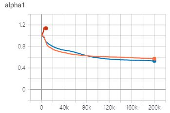
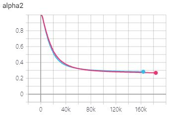
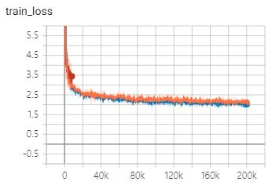
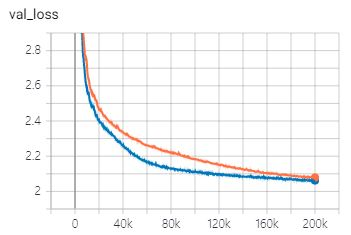

# Transformer-TTS
- Implementation of ["Neural Speech Synthesis with Transformer Network"](https://arxiv.org/abs/1809.08895)  
- This is implemented for [FastSpeech](https://github.com/Deepest-Project/FastSpeech), so I use the `FFTblock` as an encoder.


## Training  
1. Download and extract the [LJ Speech dataset](https://keithito.com/LJ-Speech-Dataset/)  
2. Make `preprocessed` folder in LJSpeech directory and make `sequence` & `melspectrogram` folder in the `preprocessed`    
3. Set `data_path` in `hparams.py` as the LJSpeech folder  
4. Using `prepare_data.ipynb`, prepare melspectrogram and text (converted into indices) tensors.  
5. `python train.py --gpu='0'`  


## Training curve (blue: batch_size:64 / red: batch_size:32)  
   
   


## Audio Samples    


## Notice  
1. Unlike the original paper, I didn't use the stop token prediction
2. I use additional ["guided attention loss"](https://arxiv.org/pdf/1710.08969.pdf) with a coefficient `10`
3. Batch size is important, so I use gradient accumulation  
   (batch_size: 64 succeed / 32 failed)  
4. Only when concatenating the input and output of the MultiheadAttention layer, the model learns diagonal alignments   

## TODO
1. Weighted Stop token prediction  
2. Dynamic batch  

## Fastspeech  
1. For fastspeech, generated melspectrograms and attention matrix should be saved for later.  
1-1. Set `teacher_path` in `hparams.py` and make `alignments` and `targets` directories there.  
1-2. Using `prepare_fastspeech.ipynb`, prepare alignmetns and targets.  
  
2. For later use in fastspeech, I change return values of the "torch.nn.functional.multi_head_attention_forward()"  
```python
#before
return attn_output, attn_output_weights.sum(dim=1) / num_heads  

#after  
return attn_output, attn_output_weights
```  
3. Among `num_layers*num_heads` attention matrices, the one with the highest focus rate is saved.
4. Only the data that meets the below condition is used in fastspeech:  
  - `The differences between attended phoneme positions for adjacent melspectrogram steps are lower than two`  

## Reference
1.NVIDIA/tacotron2: https://github.com/NVIDIA/tacotron2  
2.espnet/espnet: https://github.com/espnet/espnet  
3.soobinseo/Transformer-TTS: https://github.com/soobinseo/Transformer-TTS
