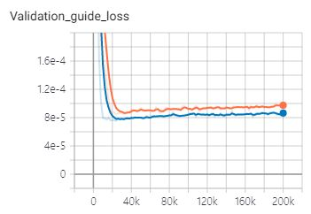
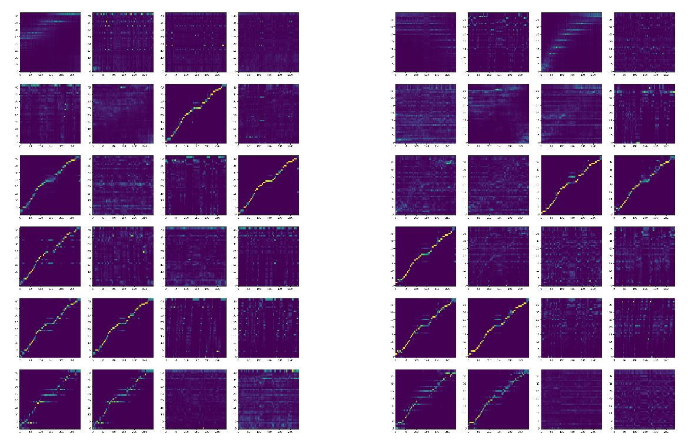
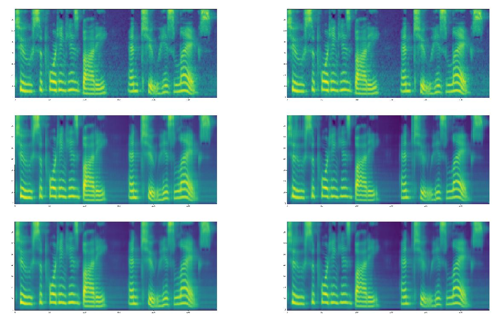

# Transformer-TTS
- Implementation of ["Neural Speech Synthesis with Transformer Network"](https://arxiv.org/abs/1809.08895)  
- This is implemented for [FastSpeech](https://github.com/Deepest-Project/FastSpeech)  
  
(2020/02/10)  
- I was able to finish this implementation by completing the Stop token prediction and remove the concatenation of inputs and outputs of multihead attention.  
- However, the alignments of this implementation are less diagonal, so it can not generate proper alignments for [fastspeech](https://github.com/Deepest-Project/FastSpeech)  
- As a result, I failed to train the fastspeech with this implementation :(  


## Training  
1. Download and extract the [LJ Speech dataset](https://keithito.com/LJ-Speech-Dataset/)  
2. Make `preprocessed` folder in LJSpeech directory and make `sequence` & `melspectrogram` folder in the `preprocessed`    
3. Set `data_path` in `hparams.py` as the LJSpeech folder  
4. Using `prepare_data.ipynb`, prepare melspectrogram and text (converted into indices) tensors.  
5. `python train.py --gpu='0'`  

## Training curve  
- Stop prediction loss (train / val)  
   
- Guided attention loss (train / val)    
   
- L1 loss (train / val)    
   

## Alignments  
- Encoder Alignments  
  
- Decoder Alignments  
  
- Encoder-Decoder Alignments  
  
- Melspectrogram (target / before / after POSTNET)  
  
- Stop prediction  
  

## Audio Samples    
You can hear the audio samples [here](https://deepest-project.github.io/Transformer-TTS/)

## Notice  
1. Unlike the original paper, I didn't use the encoder-prenet following [espnet](https://github.com/espnet/espnet)  
2. I use additional ["guided attention loss"](https://arxiv.org/pdf/1710.08969.pdf)  
3. Batch size is important, so I use gradient accumulation  

## TODO
1. Dynamic batch  

## Fastspeech  
1. For fastspeech, generated melspectrograms and attention matrix should be saved for later.  
1-1. Set `teacher_path` in `hparams.py` and make `alignments` and `targets` directories there.  
1-2. Using `prepare_fastspeech.ipynb`, prepare alignmetns and targets.  
  
2. For later use in fastspeech, I change return values of the "torch.nn.functional.multi_head_attention_forward()"  
```python
#before
return attn_output, attn_output_weights.sum(dim=1) / num_heads  

#after  
return attn_output, attn_output_weights
```  
3. Among `num_layers*num_heads` attention matrices, the one with the highest focus rate is saved.  

## Reference
1.NVIDIA/tacotron2: https://github.com/NVIDIA/tacotron2  
2.espnet/espnet: https://github.com/espnet/espnet  
3.soobinseo/Transformer-TTS: https://github.com/soobinseo/Transformer-TTS
